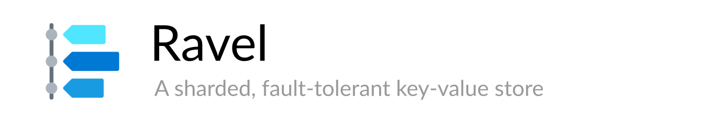

Ravel is a sharded, fault-tolerant key-value store written using [BadgerDB](https://github.com/dgraph-io/badger) 
and [hashicorp/raft](https://github.com/hashicorp/raft). You can shard your data across multiple clusters
with multiple replicas, the data is persisted on disk with BadgerDB for high performance read and write. 
Replication and fault-tolerance is done using [Raft](https://raft.github.io/). 

Ravel exposes a simple HTTP API for the user to read and write data and Ravel handles the sharding
and the replication of data across replicas in clusters.

## Table of Contents

* [Getting Started](#getting-started)
* [Documentation](#documentation)
* [Design](#design)
* [Examples](#examples)
* [Contributing](#contributing)
* [License](#license)

## Getting Started

## Documentation

## Design

## Examples

## Contributing

If you're interested in contributing to Ravel, check out [CONTRIBUTING.md](CONTRIBUTING.md)

## Contact

Reach out to the authors with questions, concerns or ideas about improvement.

* adityameharia14@gmail.com
* junaidrahim5a@gmail.com

## License

Copyright (c) **Aditya Meharia** and **Junaid Rahim**. All rights reserved. Released under the [MIT](LICENSE) License